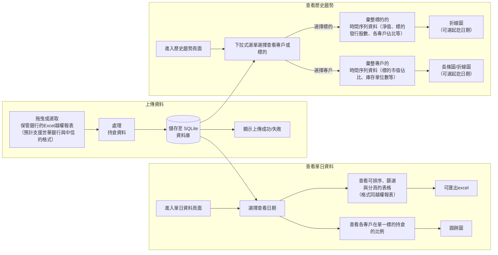

# Holdings Database

A small Dash application for uploading, storing, and exploring Excel holdings reports.

## Run

```bash
uv sync
uv run python main.py
```

Open the local URL printed by Dash (normally <http://127.0.0.1:8050>).

## Test

Run the unit tests from the project root:

```bash
UV_CACHE_DIR=/tmp/holdings-uv-cache uv run python -m unittest discover -v
```

The temporary cache setting avoids local `uv` cache-permission issues.

## Database location

By default, the application stores its SQLite database at
`<project-root>/nav_database.sqlite3`. The path is configured by the
`DATABASE_PATH` constant near the top of `src/database.py`:

```python
DATABASE_PATH = Path(__file__).resolve().parent.parent / "nav_database.sqlite3"
```

Maintainers can change the database location by updating this constant. The
current expression resolves the path relative to the project root, so it does
not depend on the directory from which the application is started.

Page-specific layouts and helpers are organized under `src/pages/` as
`upload.py`, `daily.py`, and `history.py`.

The dashboard includes:

- Drag-and-drop Excel uploads
- Polars-based parsing and cleanup for both supported custodian formats: the
  metadata-based workbook and the worksheet-per-account `越權檢核` workbook
- SQLite persistence in `nav_database.sqlite3`
- Dated inserts and updates using `(ISIN, 檢查日期)` as the composite primary key
- A single-day holdings table at `/daily` with a report-date picker
- A historical line chart at `/history`, with one series per mutual fund
- Shared navigation between Upload, By Day, and History pages
- A sortable, filterable, paginated data table

> **Note：**國泰世華銀行 Excel 中的「檢查日期」會比實際資料日期晚一個工作天。也就是說，若檢查日期為 D 日，庫存、淨值等資料實際上是 D-1 個工作天的資料，並於 D 日進行檢查。

## 使用者輸入與輸出流程


